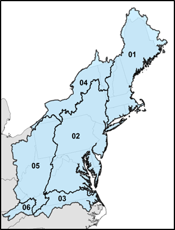

# Downloads

```{r download-setup, echo = FALSE, eval = FALSE}
library(tidyverse)
library(patchwork)
library(glue)
library(janitor)
library(targets)

knitr::opts_chunk$set(echo = FALSE, message = FALSE, warning = FALSE, comment = NA)

tar_config_set(store = "../_targets")
```

```{r download-copy, echo = FALSE}
bto_version <- tar_read(bto_version)
source_file <- file.path(tar_read(bto_wd), "bto-model.csv")
dir.create("./output", showWarnings = FALSE)
dest_filename <- glue("output/ecosheds-bto-model-v{bto_version}.csv")
file.copy(source_file, dest_filename)
```

## Model Predictions

The EcoSHEDS Northeast Brook Trout Occupancy Model predictions can be downloaded as CSV file from the following link.

> **[Brook Trout Occupancy Predictions `r bto_version` (csv)](`r dest_filename`)**

This file contains the following headers:

```{r downloads-columns}
df_columns <- tribble(
  ~column, ~label,
  "featureid","Catchment ID",
  "huc8","HUC8 ID",
  "mean_jul_temp","Mean July Stream Temp. (degC)",
  "occ_current","Occupancy Probability (Historical)",
  "occ_air_2","Occupancy Probability (+2.0 degC Air Temp)",
  "occ_air_4","Occupancy Probability (+4.0 degC Air Temp)",
  "occ_air_6","Occupancy Probability (+6.0 degC Air Temp)",
  "max_air_occ30","Max Air Temp Increase (degC) for 30% Occupancy Probability",
  "max_air_occ50","Max Air Temp Increase (degC) for 50% Occupancy Probability",
  "max_air_occ70","Max Air Temp Increase (degC) for 70% Occupancy Probability"
)
knitr::kable(df_columns, col.names = c("CSV Column", "Description"), align = "rl")
```

## Catchment Delineation

The [EcoSHEDS Northeast Catchment Delineation](http://conte-ecology.github.io/shedsGisData/) can be downloaded from the following links, which contain shapefiles grouped by HUC2 region. The model predictions dataset can be joined to these shapefiles using the common `featureid` column, which serves as the unique catchment ID.

```{r}

```

- [Region 01 Catchments (zip)](http://ecosheds.org/assets/nhdhrd/v2/spatial_01.zip)
- [Region 02 Catchments (zip)](http://ecosheds.org/assets/nhdhrd/v2/spatial_02.zip)
- [Region 03 Catchments (zip)](http://ecosheds.org/assets/nhdhrd/v2/spatial_03.zip)
- [Region 04 Catchments (zip)](http://ecosheds.org/assets/nhdhrd/v2/spatial_04.zip)
- [Region 05 Catchments (zip)](http://ecosheds.org/assets/nhdhrd/v2/spatial_05.zip)
- [Region 06 Catchments (zip)](http://ecosheds.org/assets/nhdhrd/v2/spatial_06.zip)

The documentation for the catchment delineation is also available:

> **[EcoSHEDS Northeast Catchment Delineation (docx)](http://ecosheds.org/assets/nhdhrd/v2/NHDHRDV2_Documentation.docx)**
